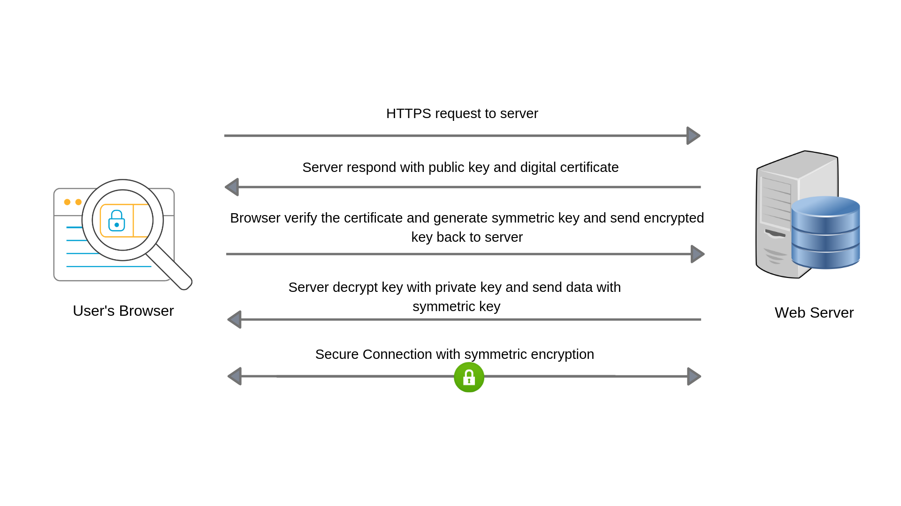
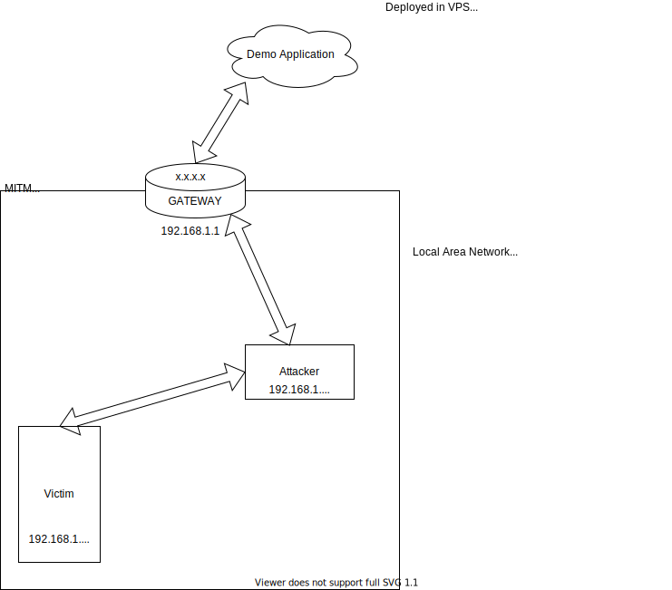
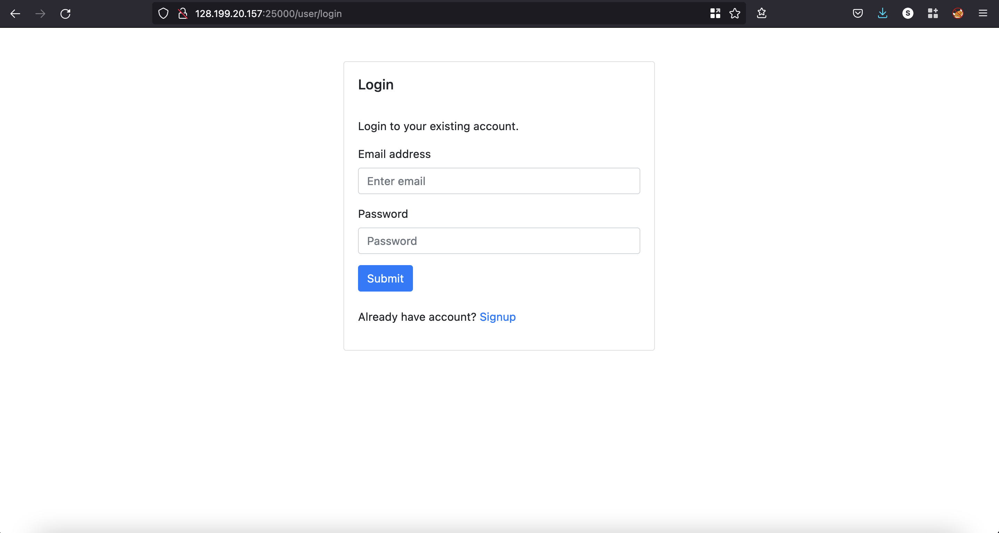
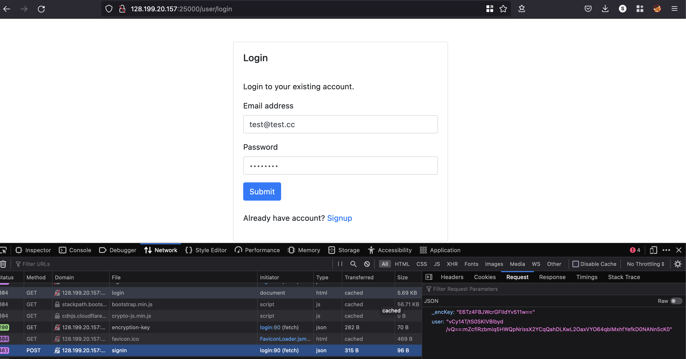
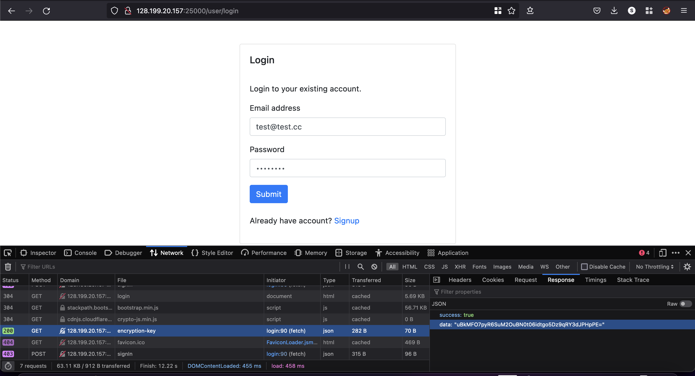
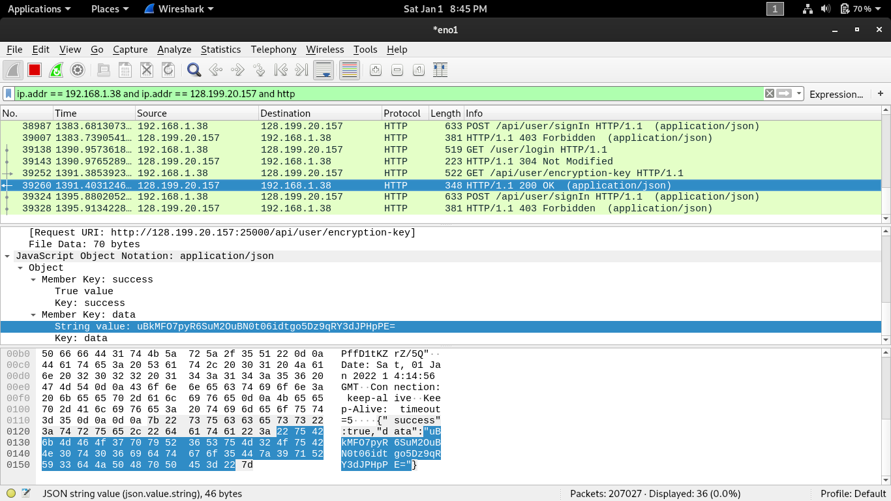
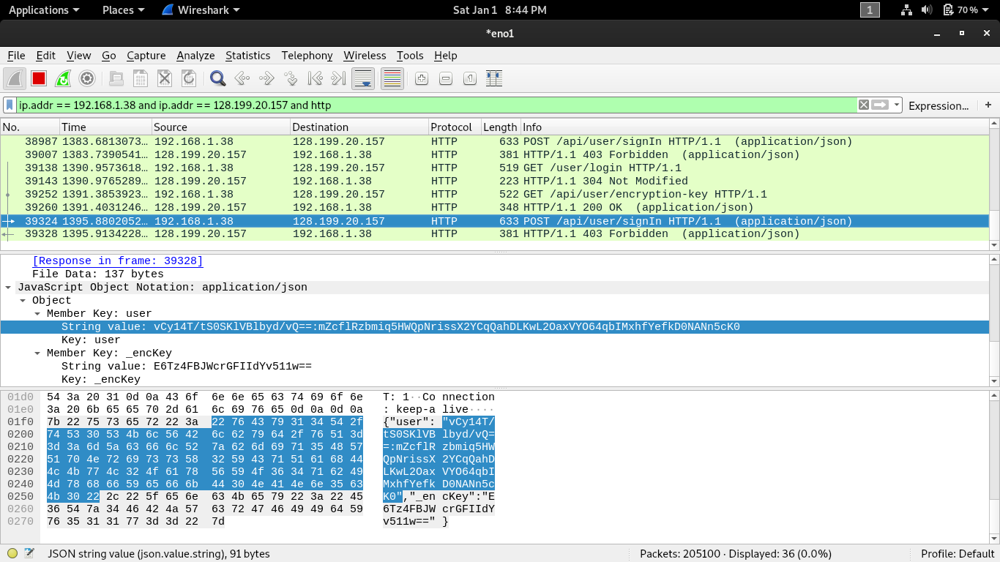
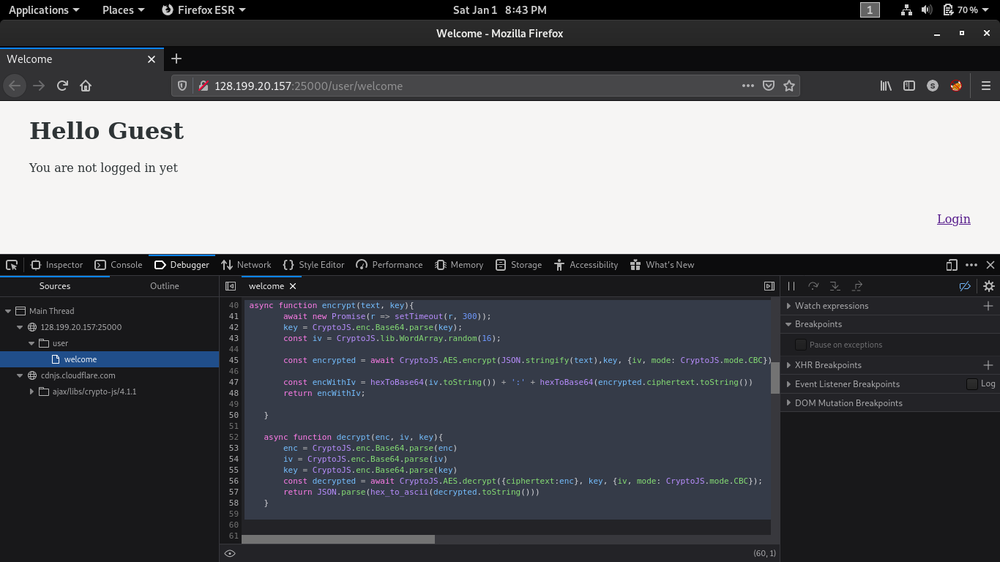
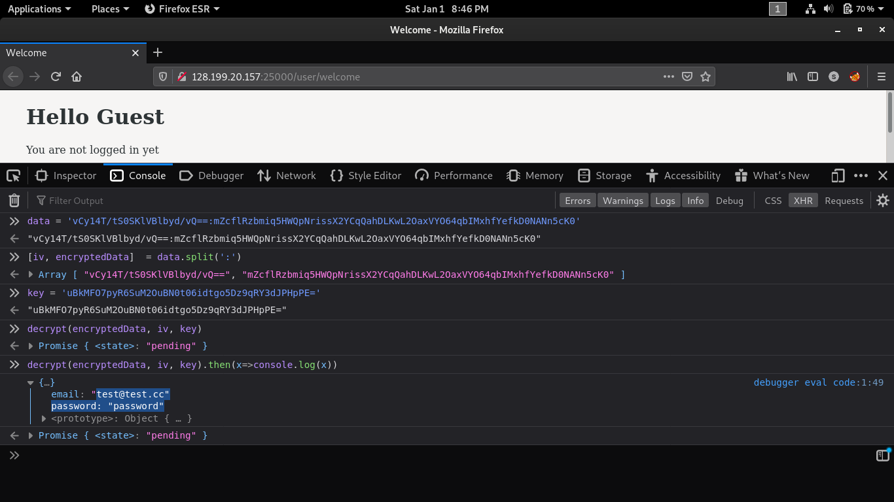

# Application layer encryption(In transit) with AES (Symmetric-key cipher)

> :warning:  **Warning** 
This application is built only for demonstrating that **application-layer encryption is useless**. 


For now we'll be focusing only on the application that uses only symmetric-key cipher for application-layer encryption.

#### How to run this application.

##### To run with docker
* Make sure you have docker and docker-compose installed.
* clone this repo by running the following command.
`
git clone https://github.com/cybersrikanth/demo-application-layer-encryption-aes.git
`
* Change directory in terminal and run the following commands to start the application.
`
cp .env.example .env
docker-compose up -d --build
`
* Once the container created and running without any issues, use the link http://localhost:25000/user/welcome to access the application.

##### To run without docker
* clone this repo by running the following command.
`
git clone https://github.com/cybersrikanth/demo-application-layer-encryption-aes.git
`
* run `cp .env.example .env`
* Install mongo db and create a database in it. Get the connection URL and update it in `.env` file.
* Install node version 16.13
* run `npm start`
* The server will start on port 25000, now use the link http://localhost:25000/user/welcome to access the application.

----
## Application layer encryption (In transit)
Application layer encryption is an additional layer of encryption added to web applications on top of TLS. People who use/suggest them say that it can protect the application from attackers even if TLS is broken or poorly implemented.

#### Some claims on application layer encryption:
* If somehow TLS is broken or the attacker can do **SSL stripping**, it will protect the users.
* If will prevent **enumeration attacks and brute-force attacks**, as attacker won't be able to create valid ciphertext. 
* An attacker can't **bypass frontend validation** by intercepting the request.
* It will protect users from **Man In The Middle** attacks.

But, these are not true. 
Before seeing it why, lets look briefly on TLS. (Please use reference links I've attached to get deeper understanding on it)
#### Security problem with HTTP:
HTTP is not considered secure, as it transmits data in cleartext. An attacker in the same network can easily eavesdrop on all HTTP requests and responses. The attacker could even intercept the requests/response. 

#### Why HTTPS?
HTTPS uses TLS for HTTP communication. Remember TLS is independent of application protocols. (i.e) You can use any application layer protocol on top of TLS for secure communication.

When we communicate via HTTPS, our entire communication is going through a TLS tunnel. (i.e) Entire HTTP packets (requests and responses) are encrypted. Even our ISP cannot see what we see. They could only see that to which IP we are communicating.


#### How TLS connection made (Simplified example)

| | 
|:--:| 
| <small><small>Image source: readybytes<span/>.in</small></small> |


* The client establishes a TCP connection with the server.
* The client receives the TLS certificate of the server.
* The **client verifies the server's TLS certificate** with the **certificate authority** that issued it.
* The Client generates a random secret, encrypts it with the public key of the server (extracted from TLS certificate), and shares it to the server, so that server can decrypt it with its private key. (**Key Exchange**)
* Client and server use **symmetric key cipher** with the shared secret key for further encrypted communication.

TLS is pretty good to for in transit encryption
#### Why application layer encryption is trash?
* If TLS is broken or attacker somehow managed to downgrade connection to HTTP, attacker in same network will be able to intercept or eavesdrop on traffic. Encrypting body of the HTTP isn't going to protect anyone, since headers and cookies can be captured by attacker.
* It won't prevent any kind of brute-force attack or prevent attackers from intercepting requests. Since the encrypting and decrypting logic will be in the applications Javascript code. So attacker will be able to modify traffic.
* The encryption key will be in plain text. So the attacker can do passive MITM (i.e) He/She can just listen and capture the key to decrypt all data.
* Even if the key is not in plain text and used key exchange algorithm like RSA, still the attacker can do Active MITM and replace the public key of the server with attacker's own public key. The client device won't be able to detect such kind of attacks.

#### Lets demonstrate it (passive MITM)
A demo application is created with AES as application layer encryption and deployed it in VPC. Since we have to evaluate its security by assuming TLS can be broken, I've deployed it without TLS.

#### How encryption works in this application
* This application is designed to use AES encryption in application layer.
* Key for encryption is should be generated from backend.
* Encryption key is hashed and sent along with all requests, so that server can find the key from its cache.
* Authenticated users will have same encryption key throughout the session. New session will have different encryption key
* Every message have random IV, so that same cipher text cannot be seen twice.

Please review the source code to understand the application better.
##### Our lab setup
| | 
|:--:| 

* An attacker connected to the victim's network sends spoofed ARP requests to the gateway and victim by running the following commands.

```
arpspoof -i interface -t <targetIP> <gateway>
arpspoof -i interface -t <gateway> <targetIP>
```
* Let's open the site's login page of our demo application in the victim's browser.

| | 
|:--:| 

* Open dev tools and choose network tab, so that we will be able to look at actual data that is transmitted.
* Refresh the page and try entering some data in the login page and press submit. We can clearly see that contents are encrypted.

|  | 
|:--:| 

* When we refresh the page, the encryption key is fetched by making an API call. This key is used to encrypt the data for the next API call.

|  | 
|:--:| 

* I've entered username "test<span/>@test.cc" and password as "password", Let's look into the attacker's machine. Since we already started arp spoof, the attacker machine should have captured all of these requests.

* Let's apply a filter in Wireshark to display only requests that have the IP address of the victim and vulnerable site. Also, apply the HTTP filter else we will be seeing a bunch of annoying TCP handshakes.

|  | 
|:--:| 
| Encryption key exposed as plain text |

|  | 
|:--:| 
| Encrypted data (username, password) exposed |

* Now we have to find how the encryption is done in the application.
* We should be able to get the code for encryption and decryption in javascript itself since application layer encryption is done with help of javascript.
* Let's open the site in the attacker's machine. Open dev tools and switch to the debugger.

|  | 
|:--:| 

* We can find that both encrypt and decrypt functions in the file.
* Since it is in global scope, we can call it from the browser console.
* Let's copy the encryption key, encrypted data from Wireshark, and try to decrypt here.

|  | 
|:--:| 

* Here we have just split iv and ciphertext from data and passed it to the decrypt function along with the encryption key.
* That's it, we successfully captured the packets via passive MITM and obtained encrypted credentials.

Let's wrap this up by looking at its advantages and disadvantages.

#### Advantages:
* It may scare script kiddies and keep them away. (this is not really an advantage)
#### Disadvantages:
* Waste of development effort.
* Hard for debugging.
* Loss of performance.
* Extremely hard for a penetration tester to test business logic (They will ignore the encrypted parts from testing).
* Application may remain vulnerable in production since pentesters might be skipped this from testing. 

#### My thoughts:
Finally, I don't find any valid reason to implement this. It protects application/user from nothing. So I consider this useless.
##### References
| Topic | Link |
|---|---|
| HTTP Requests | https://developer.mozilla.org/en-US/docs/Web/HTTP |
| Chain of Trust | https://www.keyfactor.com/blog/certificate-chain-of-trust |
| TLS Handshake Process | https://www.cloudflare.com/en-in/learning/ssl/what-happens-in-a-tls-handshake |
| MITM | https://en.wikipedia.org/wiki/Man-in-the-middle_attack |

---
Please support by following me on:
LinkedIn - [CyberSrikanth](https://linkedin.com/in/cybersrikanth/)
Twitter - [@CyberSrikanth](https://twitter.com/CyberSrikanth/)